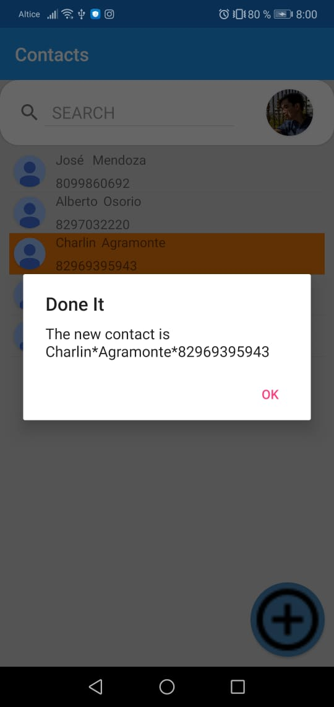
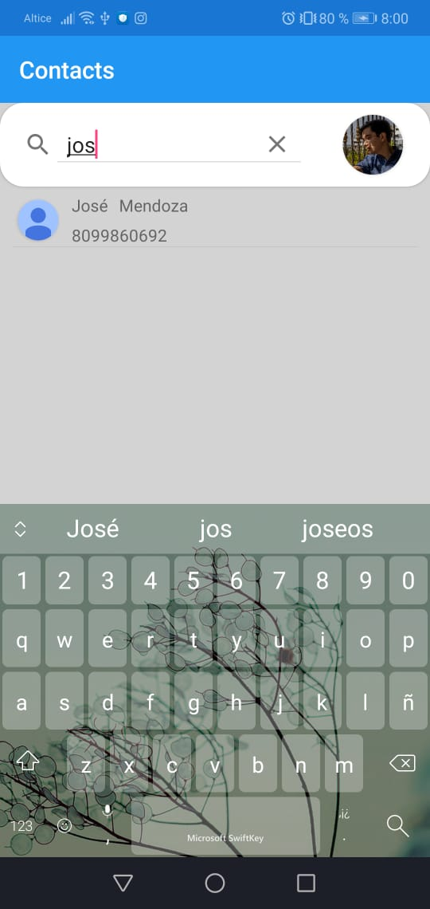

# Address_Book
 An simple example of an Address book 
 General view where you can see the contacts
 
 

It have context action where u can delete or edit a contact

Once you click 1 element this menu will be display

You can see details of the contact

This is the page where u can add a contact o a contact will be edited

You can add contacts with a QR code

Once u add a contact from a QR this message with the information will be display

You can set a photo in a porfile with your camera or from your galery

You can search the contact that u want

